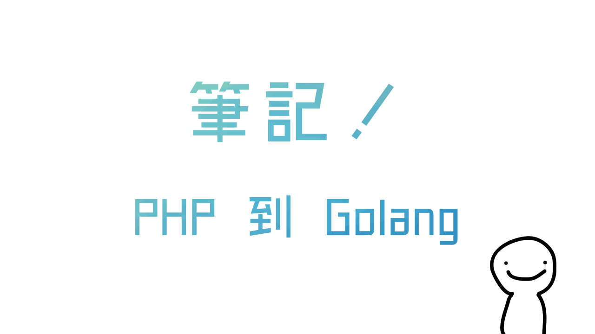

# 從 PHP 到 Golang 的筆記

* [定義變數－Variables](#定義變數variables)

* [函式－Function](#函式function)

* [匿名函式－Anonymous Function](匿名函式anonymous-function)

* [多資料儲存型態－Stores](#多資料儲存型態stores)

    * [陣列－Array](#陣列array)
    
    * [切片－Slice](#切片slice)
    
    * [映照－Map](#映照map)
    
    * [接口－Interface](#接口interface)

* [不定值－Mixed Type](#不定值mixed-type)

* [跳往－Goto](#跳往goto)

* [迴圈－Loops](#迴圈foreach)
    
    * [一般－For]()
    
    * [每個－Foreach]()
    
    * [當 .. 重複－While]()
    
    * [做 .. 重複－Do While]()
    
* [日期－Date](#日期date)

* [切割字串－Split（Explode）](#切割字串splitexplode)

* [關聯陣列－Associative Array](#關聯陣列associative-array)

* [是否存在－Isset](#是否存在isset)

* [指針－Pointer](#指針pointer)

* [錯誤處理－Error Exception]()

* [套件／匯入／匯出－Package / Import / Export]()

    * [套件－Package](#套件package)
    
    * [匯入－Import](#匯入import)
    
    * [匯出－Export](#匯出export)

* [類別－Class](#類別class)

   * [一般－Normal](#一般normal)
   
   * [建構子－Constructor](#建構子constructor)
   
   * [嵌入－Embedding](#嵌入embed)
   
   * [遮蔽－Shadowing](#遮蔽shadowing)
   
   * [多形－Polymorphism](#多形polymorphism)


&nbsp;

## 我為什麼從 PHP 轉到 Golang？

PHP 和模塊之間的關係令人感到煩躁，假設你要讀取 `yaml` 檔案，你需要有一個 `yaml` 的模塊，為此，你還需要將其編譯然後將編譯後的模塊擺放至指定位置，之後換了一台伺服器你還要重新編譯，這點到現在還是沒有改善；順帶一提之後出了 PHP 7 效能確實提升了許多（比 Python 3 快了些），但 PHP 仍令我感到臃腫，我覺得是時候 <br>（轉行）了。

PHP 和 Golang 的效能我想毋庸置疑是後者比較快（而且是以倍數來算），也許有的人會認為兩種不應該被放在一起比較，但 Golang 本身就是偏向 Web 開發的，所以這也是為什麼我考慮轉用 Golang 的原因，起初我的考慮有幾個：Node.js 和 Rust 還有最終被選定的 Golang；先談談 Node.js 吧。

### Node.js

Node.js 的效能可以說是快上 PHP [3.5倍至6倍左右](http://benchmarksgame.alioth.debian.org/u64q/compare.php?lang=php&lang2=node)，而且撰寫的語言還是 JavaScript，蒸蚌，如此一來就不需要學習新語言了！搭配 Babel 更可以說是萬能，不過那跟「跳跳虎」一樣的 Async 邏輯還有那恐怖的 Callback Hell，有人認為前者是種優點，這點我不否認，但是對學習 PHP 的我來說太過於 "Mind Fuck"，至於後者的 Callback Hell 雖然有 Promise，但是那又是另一個「Then Hell」的故事了。相較於 Golang 之下，Node.js 似乎就沒有那麼吸引我了。你確實可以用 Node.js 寫出很多東西，不過那 V8 引擎的效能仍然有限，而且要學習新的事物，不就應該是「全新」的嗎 ;)？

### Rust

在拋棄改用 Node.js 之後我曾經花了一天的時間嘗試 Rust 和 Iron 框架，嗯⋯⋯Rust 太強大了，強大到讓我覺得 Rust 不應該用在這裡，這想法也許很蠢，但 Rust 讓我覺得適合更應該拿來用在系統或者是部分底層的地方，而不應該是網路服務，順帶一提 Rust 快過於 Golang [1倍至1.5倍左右](http://benchmarksgame.alioth.debian.org/u64q/compare.php?lang=rust&lang2=go)。

### Golang

Golang 是我最終的選擇，主要在於我花了一天的時間來研究的時候意外地發現 Golang 夭壽簡潔（[關鍵字只有25個](https://astaxie.gitbooks.io/build-web-application-with-golang/content/zh/02.8.html)），相較之下 Rust 太過於「強大」令我怯步；而且 Golang 帶有許多工具，例如 `go fmt` 會自動幫你整理程式碼、`go doc` 會自動幫你生產文件、`go test` 可以自動單元測試並生產覆蓋率報表、也有 `go get` 套件管理工具（雖然沒有版本功能），不過都很實用，而且也不需要加上分號（`;`），真要說不好的地方⋯⋯大概就是強迫你花括號不能換行放吧（沒錯，我就是花括號會換行放的人）。

&nbsp;

## 還請先閱讀⋯

當我在撰寫這份文件的時候*我會先假設你有一定的基礎*，

你可以先閱讀下列的手冊，他們都很不錯。

[《Effective Go》中英双语版](https://bingohuang.gitbooks.io/effective-go-zh-en/content)

[Go語言聖經（中文版）](https://wizardforcel.gitbooks.io/gopl-zh/content)

[Go Web 编程](https://astaxie.gitbooks.io/build-web-application-with-golang/content)

[Golang concepts from an OOP point of view](https://github.com/luciotato/golang-notes/blob/master/OOP.md)

&nbsp;

## 定義變數－Variables

你能夠在 PHP 裡面想建立一個變數的時候就直接建立，夭壽讚，是嗎？

```php
$a = "foo";
$b = "bar";
```

蒸蚌！那麼 Golang 呢？在 Golang 中變數分為幾類：「新定義」、「預先定義」、「自動新定義」、「覆蓋」。

讓我們來看看範例：

```go
// 新定義：定義新的 a 變數為字串型別，而且值是「foo」
var a string = "foo"

// 預先定義：先定義一個新的 b 變數為字串型別但是不賦予值
var b string

// 自動新定義：讓 Golang 依照值的內容自己定義新變數的資料型態
c := "bar"

// 覆蓋：先前已經定義過 a 了，所以可以像這樣直接覆蓋其值
a = "fooooooo"
```

&nbsp;

## 函式－Function

這很簡單，而且兩個語言的用法相差甚少，下面這是 PHP：

```php
function test()
{
    return "Hello, world!";
}

echo test(); // 輸出：Hello, world!
```

忘了告訴你，只是 Golang 稍微聒噪了一點，你必須**在函式後面宣告他最後會回傳什麼資料型別**。

```go
func test() string {
    return "Hello, world!"
}

fmt.Println(test()) // 輸出：Hello, world!
```

&nbsp;

## 匿名函式－Anonymous Function

兩個語言的撰寫方式不盡相同，這是 PHP 的匿名函式：

```php
$a = function()
{
    echo "Hello, world!";
};

$a(); // 輸出：Hello, world!
```

然後這是 Golang：

```go
a := func() {
    fmt.Println("Hello, world!")
}
	
a() // 輸出：Hello, world!
```

&nbsp;

## 多資料儲存型態－Stores

主要是 PHP 的陣列能做太多事情了，所以在 PHP 裡面要儲存什麼用陣列就好了。

```php
$array  = [1, 2, 3, 4, 5];
$array2 = ['username' => 'YamiOdymel', 
           'password' => '2016 Spring'];
```

在 Golang 裡⋯⋯沒有這麼萬能的東西，首先要先了解 Golang 中有這些型態：`array`, `slice`, `map`, `interface`，

你他媽的我到底看了三洨，首先你要知道 Golang 是個強型別語言，意思是你的陣列中**只能有一種型態**，什麼意思？當你決定**這個陣列是用來擺放字串資料的時候，你就只能在裡面放字串**，沒有數值，沒有布林值，就像你沒有女朋友一樣。

### 陣列－Array

> 一個存放固定長度的陣列。

先撇開 PHP 的「萬能陣列」不管，Golang 中的陣列既**單純卻又十分腦殘**，在定義一個陣列的時候，你必須給他一個**長度**還有**其內容存放的資料型態**，你的陣列內容**不一定要填滿其長度**，但是你的**陣列內容不能超過你當初定義的長度**。

如果你在 PHP 中這麼寫：

```php
$a = ["foo", "bar"];

echo $a[0]; // 輸出：foo
```

那麼這就是你在 Golang 如何將其實作：

```go
var a [2]string

a[0] = "foo"
a[1] = "bar"

fmt.Println(a[0]) // 輸出：foo
```

### 切片－Slice

> 可供「裁切」而且供自由擴展的陣列。

切片⋯⋯這聽起來也許很奇怪，但是你確實可以「切」他，讓我們先談談「切片」比起「陣列」要好在哪裡：「**你不用定義其最大長度**，而且你可以**直接賦予值**」，沒了。

所以你在 PHP 中這麼寫（*靠腰 啊不是跟剛才一樣*）：

```php
$a = ["foo", "bar"];

echo $a[0]; // 輸出：foo
```

你會在 Golang 中這樣撰寫：

```go
a := []string{"foo", "bar"}

fmt.Println(a[0]) // 輸出：foo
```

我們剛才有提到你可以「切」他，記得嗎？這有點像是 PHP 中的 `array_slice()`，但是 Golang 直接讓 Slice「*內建*」了這個用法，其用法是：`slice[開始:結束]`。

```go
p := []int{1, 2, 3, 4, 5, 6}

fmt.Println(p[0:1]) // 輸出：[1]
fmt.Println(p[1:1]) // 輸出：[]  （！注意這跟 PHP 不一樣！）
fmt.Println(p[1:])  // 輸出：[2, 3, 4, 5, 6]
fmt.Println(p[:1])  // 輸出：[1]
```

在 PHP 中倒是沒有那麼方便，在下列 PHP 範例中你需要不斷地使用 `array_slice()`。

```php
$p = [1, 2, 3, 4, 5, 6];

echo array_slice($p, 0, 1); // 輸出：[1]
echo array_slice($p, 1, 1); // 輸出：[2]
echo array_slice($p, 1);    // 輸出：[2, 3, 4, 5, 6]
echo array_slice($p, 0, 1); // 輸出：[1]
```

### 映照－Map

> 有鍵名和鍵值的陣列。

你可以把「映照」看成是一個有鍵名和鍵值的陣列，但是記住：「**你需要事先定義其鍵名、鍵值的資料型態**」，這仍限制你**沒辦法**在映照中存放多種不同型態的資料。

讓我們先來個 PHP 範例：

```php
$data["username"] = "YamiOdymel";
$data["password"] = "2016 Spring";

echo $data["username"]; // 輸出：YamiOdymel
```

在 Golang 裡可就沒這麼簡單了，你需要先用 `make()` 宣告 `map`。

```go
data := make(map[string]string)

data["username"] = "YamiOdymel"
data["password"] = "2016 Spring"

fmt.Println(data["username"]) // 輸出：YamiOdymel
```

### 接口－Interface

> 終於；一個可存放多種資料型態的陣列，但難以捉模（幹）。

也許你不喜歡「接口」這個詞，但用「介面」我怕會誤導大眾，所以，是的，接下來我會繼續稱其為「接口」。

還記得你可以在 PHP 的關聯陣列裡面存放任何型態的資料嗎，像下面這樣？

```php
$mixedData  = ["foobar", 123456];
$mixedData2 = ['username' => 'YamiOdymel', 
               'time'     => 123456];
```

現在你有福了！正因為 Golang 中的 `interface{}` **可以接受任何內容**，所以你可以把它拿來**存放任何型態的資料**。

```go
mixedData := []interface{"foobar", 123456}

mixedData2 := make(map[string]interface{})
mixedData2["username"] = "YamiOdymel"
mixedData2["time"]     = 123456
```

&nbsp;

## 不定值－Mixed Type

有時候你也許會有個不定值的變數，在 PHP 裏你可以直接將一個變數定義成字串、數值、空值、就像你那變心的女友一樣隨時都在變。

```php
$mixed = 123;
echo $mixed; // 輸出：123

$mixed = "Moon, Dalan!";
echo $mixed; // 輸出：Moon, Dalan!

$mixed = ["A", "B", "C"];
echo $mixed; // 輸出：["A", "B", "C"]
```

在 Golang 中你必須給予變數一個指定的資料型別，不過還記得剛才提到的：「Golang 中有個 `interface{}` 能夠**存放任何事物**」嗎（*雖然也不是真的任何事物啦⋯⋯*）？

```go
var mixed interface{}

mixed = 123
fmt.Println(mixed) // 輸出：123

mixed = "Moon, Dalan!"
fmt.Println(mixed) // 輸出：Moon, Dalan!

mixed = []string{"A", "B", "C"}
fmt.Println(mixed) // 輸出：["A", "B", "C"]
```

&nbsp;

## 跳往－Goto

這東西很邪惡，不是嗎？又不是在寫 BASIC，不過也許有時候你會在 PHP 呢，但是拜託，不要。

```php
goto a;
echo "foo";
 
a:
echo 'bar'; // 輸出：bar
```

在 Golang 也有相同的東西，令人感到神奇。

```go
goto a
fmt.Println("foo")

a:
fmt.Println("bar") // 輸出：bar
```

&nbsp;

## 迴圈－Loops

Golang 中僅有 `for` 一種迴圈但卻能夠達成 `foreach`, `while`, `for` 多種用法。

### 一般－For

普通 For 迴圈寫法在兩個語言中都十分相近，首先這是 PHP：

```php
for($i = 0; $i < 3; $i++)
    echo $i; // 輸出：012
    
$j = 0;
for($j; $j < 5; $j++)
    echo $j; // 輸出：01234
```

在 Golang 請記得：如果你的 `i` 先前並不存在，那麼**你就需要定義它**，所以下面這個範例你會看見 `i := 0`。

```go
for i := 0; i < 3; i++ {
    fmt.Println(i) // 輸出 012
}

j := 0
for ; j < 5 ; j++ {
    fmt.Println(j) // 輸出：01234
}
```

### 每個－Foreach

在 PHP 裡，`foreach()` 能夠直接給你值和鍵名，用起來十分簡單：

```php
$data = ['a', 'b', 'c'];

foreach($data as $index => $value)
    echo $index . $value . '|' ; // 輸出：0a|1b|2c|

foreach($data as $index => $value)
    echo $index . '|' ; // 輸出：0|1|2|
    
foreach($data as $value)
    echo $value . '|' ; // 輸出：a|b|c|
```

Golang 裡面雖然僅有 `for()` 但卻可以使用 `range` 達成和 PHP 一樣的 `foreach` 方式：

```go
data := []string{"a", "b", "c"}

for index, value := range data {
    fmt.Printf("%d%s|", index, value)  // 輸出：0a|1b|2c|
}

for index := range data {
    fmt.Printf("%d|", index)  // 輸出：0|1|2|
}

for _, value := range data {
    fmt.Printf("%s|", value)  // 輸出：a|b|c|
}
```

### 當 .. 重複－While

一個 `while(條件)` 迴圈在 PHP 裡面可以不斷地執行區塊中的程式，直到 `條件` 為 `false` 為止。

```php
$i = 0;

while( $i < 3 )
    $i++;
    echo $i; // 輸出：123
```

在 Golang 裡也有相同的做法，但仍是透過 `for` 迴圈，請注意**這個 `for` 迴圈並沒有任何的分號（`;`）**。

```go
i := 0

for i < 3 {
    i++
    fmt.Println(i) // 輸出：123
}
```

### 做 .. 重複－Do While

PHP 中有 `do .. while()` 迴圈可以先做區塊中的動作。

```php
$i = 0;

do
{
    $i++;
    echo $i; // 輸出：123
}
while($i < 3);
```

在 Golang 中則沒有相關函式，但是你可以透過一個無止盡的 `for` 迴圈加上條件式來讓他結束迴圈。

```go
i := 0

for {
    i++
    fmt.Println(i) // 輸出：123
    
    // 注意這個條件式和 PHP 有所不同
    if i > 2 {
        break
    }
}
```

要是你真的希望完全符合像是 PHP 那樣的設計方式，或者你可以在 Golang 中使用很邪惡的 `goto`。

```go
i := 0

LOOP:
    i++
    fmt.Println(i) // 輸出：123
    
    if i < 3 {
        goto LOOP
    }
```

&nbsp;

## 日期－Date

在 PHP 中我們可以透過 `date()` 像這樣取得目前的日期：

```php
echo data("Y-m-d H:i:s"); // 輸出：2016-07-13 12:59:59
```

在 Golang 就稍微有趣點了，因為 Golang 會**自動偵測格式**，像這樣：

```go
fmt.Println(time.Now().Format("2006-2-1 03:04:00"))          // 輸出：2016-07-13 12:59:59
fmt.Println(time.Now().Format("Mon, Jan 2, 2006 at 3:04pm")) // 輸出： Mon, Jul 13, 2016 at 12:59pm
```

&nbsp;

## 切割字串－Split（Explode）

俗話說：「爆炸就是藝術」，我們可愛的 PHP 用詞真的很大膽，像是：`explode()`（爆炸）、`die()`（死掉），

回歸正傳，如果你想在 PHP 裡面將字串切割成陣列，你可以這麼做：

```php
$data  = "a, b, c, d";
$array = explode(", ", $data);
```

簡單的就讓一個字串給「爆炸」了，那麼 Golang 呢？

```go
data  := "a, b, c, d"
array := strings.Split(data, ", ")
```

對了，**記得引用 `strings` 套件**。

&nbsp;

## 關聯陣列－Associative Array

這真的是很常用到的功能，就像物件一樣有著鍵名和鍵值，在 PHP 裡面你很簡單的就能靠*陣列（Array）*辦到。

```php
$data = ['username' => 'YamiOdymel',
         'password' => '2016 Spring'];
         
echo $data["username"]; // 輸出：YamiOdymel
```

真是太棒了，那麼 Golang 呢？用 `map` 是差不多啦。如果有必要的話，你可以稍微複習一下先前提到的「多資料儲存型態－Stores」。

```go
data := map[string]string{
           "username": "YamiOdymel", 
           "password": "2016 Spring"}

fmt.Println(data["password"])
```

&nbsp;

## 是否存在－Isset

你很常會在 PHP 裡面用 `isset()` 檢查一個索引是否存在，不是嗎？

```php
// 如果 $data['username'] 存在
if(isset($data['username']))
{
    $username = $data['username'];
}
```

在 Golang 裡面很簡單的能夠這樣辦到（僅適用於 `map`）：

```go
username, exists := data["username"]

if !exists {
    fmt.Printf("你要找的資料不存在。")
}
```
&nbsp;

## 指針－Pointer

指針（也做參照）是一個像是「變數別名」的方法，這種方法讓你不用整天覆蓋舊的變數，

讓我們假設 `A = 1; B = A;` 這個時候 `B` 會複製一份 `A` 且**兩者不相干**，

倘若你希望修改 `B` 的時候實際上也會修改到 `A` 的值，就**會需要指針**。

在 PHP 的實際範例是這樣：

```php
function zero(&$number) // & 即是指針
{
    $number = 0;
}

$A = 5;
zero($A);

echo $A; // 輸出：0
```

在 Golang 你需要用上 `*` 還有 `&` 符號，你可以稍微這樣區分這兩者：

> `&`：我給你

> `*`：還給你

```go
func zero(number *int) {
    *number = 0
}

func main() {
    A := 5;
    zero(&A)

    fmt.Printf("%d", A) // 輸出：0
}
```

&nbsp;

## 錯誤處理－Error Exception

&nbsp;

## 套件／匯入／匯出－Package / Import / Export

還記得在 PHP 裡要引用一堆檔案的日子嗎？到處可見的 `require()` 或是 `include()`？

到了 Golang 這些都不見了，取而代之的是「套件（Package）」。現在讓我們來用 PHP 解釋一下。

```php
// a.php
<?php
    $foo = "bar";
?>
```
```php
// index.php
<?php
    include "a.php";
    
    echo $foo; // 輸出：bar
?>
```

這看起來很正常對吧？但假設你有一堆檔案，這馬上就成了 `Include Hell`，讓我們看看 Golang 怎麼透過「套件」解決這個問題。

```go
// a.go
package main

var foo string = "bar"
```

```go
// main.go
package main

import "fmt"

func main() {
    fmt.Println(foo) // 輸出：bar
}
```

「*蛤？？？殺小？？？*」你可能如此地說道。

是的，`main.go` 中除了引用 `fmt` 套件（*為了要輸出結果用的套件*）之外**完全沒有引用到 `a.go`**。

「*蛤？？？殺小？？？？？？*」你彷彿回到了幾秒鐘前的自己。

既然沒有引用其他檔案，為什麼 `main.go` 可以輸出 `foo` 呢？注意到了嗎，**兩者都是屬於 `main` 套件**，因此**他們共享同一個區域**，所以接下來要介紹的是什麼叫做「套件」。

### 套件－Package

套件是每一個 `.go` 檔案都必須聲明在 Golang 原始碼中最開端的東西，像下面這樣：

```go
package main
```

這意味著目前的檔案是屬於 `main` 套件（*你也可以依照你的喜好命名*），那麼要如何讓**同個套件之間的函式溝通**呢？先用你熟悉的 PHP 來做解釋：

```php
// a.php
<?php
    function foo()
    {
        // ...
    }
?>
```
```php
// index.php
<?php
    include "a.php";
    
    foo();
?>
```

接著是 Golang；注意！你**不需要引用任何檔案**，因為下列兩個檔案**同屬一個套件**。

```go
// a.go
package main

func foo() {
    // ...
}
```

```go
// main.go
package main

func main() {
    foo()
}
```

一個由「套件」所掌握的世界，比起 PHP 的 `include()` 和 `require()` 還要好太多了，對嗎？

### 匯入－Import

在 Golang 中沒有引用單獨檔案的方式，你必須**匯入一整個套件**，而且你要記住：「**一定你匯入了，你就一定要使用它**」，像下面這樣。

```go
package main

import (
    "fmt"                           // 引用底層套件
    "time"                          // 這也是底層套件
    "github.com/yamiodymel/teameow" // 來自 Github 的 "teameow" 套件
)

func main() {
    // 然後像下面這樣使用你剛匯入的套件
    fmt.XXX()
    time.XXX()
    teameow.XXX()
}
```

假如**你不希望使用你匯入的套件**，你**只是為了要觸發那個套件的 `main()` 函式而引用**的，那麼你可以在前面**加上一個底線（`_`）**。

```go
import (
    _ "fmt"
)
```

如果你的套件出現了**名稱衝突**，你可以**在套件來源前面給他一個新的名稱**。

```go
import (
    "github.com/karisu/teameow"
    neko "github.com/yamiodymel/teameow"
)

func main() {
    teameow.XXX()
    neko.XXX()
}
```

### 匯出－Export

現在你知道可以匯入套件了，那麼什麼是「匯出」？同個套件內的函式還有共享變數確實可以直接用，但那**並不表示可以給其他套件使用**，

其方法取決於**函式／變數的「開頭大小寫」**，是的，**Golang 依照一個函式／變數的開頭大小寫決定這個東西是否可供「匯出」**。

```go
// a.go
package hello

// 注意：這裡的 Foo 的開頭字母是大寫！
var Foo string = "bar"

// 注意：這個 World 函式的開頭字母是大寫！
func World() {
    // ...
}
```

```go
// b.go
package test

import (
    "hello"
    "fmt"
)

func main() {
    fmt.Println(hello.Foo) // 輸出：bar
    
    hello.World()
}
```

這用在區別函式的時候格外有用，因為**小寫開頭的任何事物都是不供匯出的**，反之，**大寫開頭的任何事物都是用來匯出供其他套件使用的**。

&nbsp;

## 類別－Class

在 Golang 中沒有類別，給你一張衛生紙，你要學會不哭；正所謂「上有政策，下有對策」，Golang 中有所謂的「**建構體（Struct）**」和「**接口（Interface）**」，這就能夠滿足幾乎所有的需求了，這也是為什麼我認為 Golang 很簡潔卻又很強大的原因。

### 一般－Normal

讓我們先用 PHP 建立一個類別，然後看看 Golang 怎麼解決這個問題。

```php
class Foobar
{
    public $a = "hello, world";
    
    public function test()
    {
        echo $this->a;
    }
}

$b = new Foobar();
$b->test(); // 輸出：hello, world!
```

雖然 Golang 沒有類別，但是「**建構體（Struct）**」就十分地堪用了，首先你要知道在 Golang 中「類別」的成員還有方法都是在「類別」**外面**所定義的，**跟 PHP 在類別內定義的方式有所不同**，在 Golang 中還有一點，那就是他們**沒有** `public`, `private`, `protected` 的種類。

```go
// 先定義一個 Foobar 建構體，然後有個叫做 a 的字串成員
type Foobar struct {
    a string
}

// 定義一個屬於 Foobar 的 test 方法
func (f *Foobar) test () {
    // 接收來自 Foobar 的 a（等同於 PHP 的 `$this->a`）
    fmt.Println(f.a)
}

b := &Foobar{a: "hello, world!"}
b.test() // 輸出：hello, world!
```

### 建構子－Constructor

在 PHP 中，當有一個類別被 `new` 的時候會自動執行該類別內的建構子（`__construct()`），通常你會用這個來初始化一些類別內部的值。

```php
class Test
{
    public $a;
    
    function __construct()
    {
        $this->a = "foobar";
    }
    
    function show()
    {
        echo $this->a;
    }
}

$b = new Test();
$b->show(); // 輸出：foobar
```

但是在 Golang 裡**因為沒有類別，也就沒有建構子**，不巧的是**建構體本身也不帶有建構子的特性**，

這個時候你**只能自己在外部建立一個建構用函式**。

```go
type Test struct {
    a string
}

func (t *Test) show() {
    fmt.Println(t.a)
}

// 用來建構 Test 的假建構子
func newTest() (test *Test) {
    test = &Test{a: "foobar"}
    
    // 這裡會回傳一個型態是 *Test 建構體的 test 變數
    return
}

b := newTest()
b.show() // 輸出：Hello, world!
```

### 嵌入－Embed

讓我們假設你有兩個類別，你會把其中一個類別傳入到另一個類別裡面使用，廢話不多說！先上個 PHP 範例（*為了簡短篇幅我省去了換行*）。

```php
class Foo
{
    public $msg = "Hello, world!";
}

class Bar
{
    public $foo;
    
    function __construct($foo){ $this->foo = $foo;    }
    function show()           { echo $this->foo->msg; }
}

$a = new Foo();
$b = new Bar($a);
$b->show(); // 輸出：Hello, world!
```

在 Golang 中你也有相同的用法，但是請記得：「**任何東西都是在「類別」外完成建構的**」。

```go
type Foo struct {
    msg string
}

type Bar struct {
    *Foo
}

func (b *Bar) show() {
    // Foo 中的 msg 會直接暴露在 Bar 底下
    // 所以你可以直接使用 b.msg
    fmt.Println(b.msg)
}

a := &Foo{msg: "Hello, world!"}
b := &Bar{a}
b.show() // 輸出 Hello, world!
```

### 遮蔽－Shadowing

在 PHP 中沒有相關的範例，這部分會以剛才「嵌入」章節中的 Golang 範例作為解說對象，你可以看見 Golang 在進行 `Foo` 嵌入 `Bar` 的時候，會自動將 `Foo` 的成員**暴露**在 `Bar` 底下，那麼*假設雙方之間有相同的成員名稱*呢？這個時候被嵌入的成員就會被「**遮蔽**」，下面是個實際範例，還有你如何解決遮蔽問題：

```go
type Foo struct {
    msg string
}

type Bar struct {
    *Foo
    msg string // 遮蔽了 Foo 的 msg
}

a := &Foo{msg: "Hello, world!"}
b := &Bar{Foo: a, msg: "Moon, Dalan!"}

fmt.Println(b.msg)     // 輸出：Moon, Dalan!
fmt.Println(b.Foo.msg) // 輸出：Hello, world!
```

### 多形－Polymorphism

雖然都是呼叫同一個函式，但是這個**函式可以針對不同的資料來源做出不同的舉動**，這就是**多形**。你也能夠把這看作是：「**訊息的意義由接收者定義，而不是傳送者**」，目前 PHP 中沒有真正的「多形」，不過你仍可以做出同樣的東西。

```php
class Foo{ public $msg = "hello";  }
class Bar{ public $msg = "world!"; }

class Handler
{
    public function process($class)
    {
        switch(get_class($class))
        {
            // 依照不同的資料類型做出不同的舉動
            case 'Foo':
                echo '處理 Foo | ' . $class->msg . ', world!';
                break;
                
            case 'Bar':
                echo '處理 Bar | ' . 'hello, ' . $class->msg;
                break;
        }
    }
}

$foo = new Foo();
$bar = new Bar();
$handler = new Handler();

// 雖然都是同個函式，但是可以處理不同資料
$handler->process($foo); // 輸出：處理 Foo | hello, world!
$handler->process($bar); // 輸出：處理 Bar | hello, world!
```

嗯⋯⋯那麼 Golang 呢？實際上更簡單而且更有條理了，在 Golang 中有 `interface` 可以幫忙完成這個工作。

```go
type Foo struct {
    msg string
}

type Bar struct {
    msg string
}

// 透過 Handler 實作 process
type Handler interface {
    process()
}

// 處理 Foo 資料的 process
func (f Foo) process() {
    fmt.Printf("處理 Foo | %s, world!", f.msg)
}

// 處理 Bar 資料的 process
func (b Bar) process() {
    fmt.Printf("處理 Bar | hello, %s", f.msg)
}

foo := Foo{msg: "hello"}
bar := Bar{msg: "world!"}

// 雖然都是同個函式，但是可以處理不同資料
Handler.process(foo) // 輸出：處理 Foo | hello, world!
Handler.process(bar) // 輸出：處理 Bar | hello, world!
```
